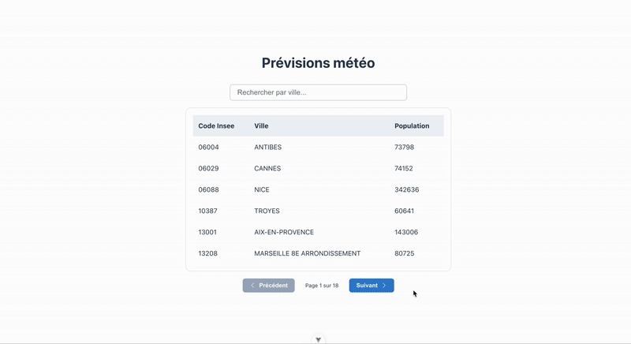

# Adcleek Weather App

> Test technique réalisé pour la société **Adcleek**.

Ce projet est une application météo découpée en deux parties :

- Un **backend** Node.js (Express) qui fournit les données météo.
- Un **frontend** Vue 3 (Vite + TypeScript) pour l’interface utilisateur.

---



---

## Structure du projet

```
.
├── backend         # Backend Node.js + Express
└── frontend        # Frontend Vue 3 + Vite
```

## Prérequis

- Node.js **≥ 18**
- Une clé API `METEO_API_KEY`

---

## Lancer l'application

### 1. Backend

```bash
cd backend
npm install
cp .env # Créez ce fichier si besoin
# Ajoutez votre clé API météo :
# METEO_API_KEY=VOTRE_CLE_API_METEO
npm run start
```

API accessible via : [http://localhost:3000](http://localhost:3000)

---

### 2. Frontend

```bash
cd frontend
npm install
npm run dev
```

Application visible sur : [http://localhost:5173](http://localhost:5173)

---

## Notes supplémentaires

- Le frontend consomme l’API via un proxy configuré dans `vite.config.js` (`/api` → `localhost:3000`).
- Les données sont récupérées avec **axios** via un service dédié.
- Le style est géré via **CSS scoped**.
- Utilisation de **Bootstrap Icons** pour les pictogrammes.
- Responsive sur desktop ; prévoir ajustements mobile selon contexte.

---

## Démonstration

Le GIF `test-adcleek.gif` montre le rendu dynamique de l’app, incluant :

- Chargement des villes
- Sélection et affichage de prévisions météo
- Modal responsive

---

Réalisé avec soin pour **Adcleek**
